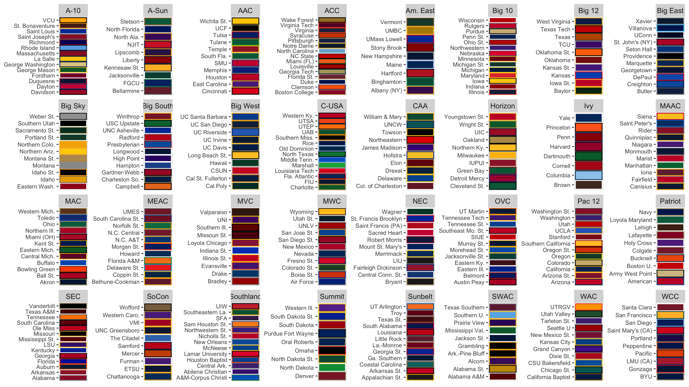
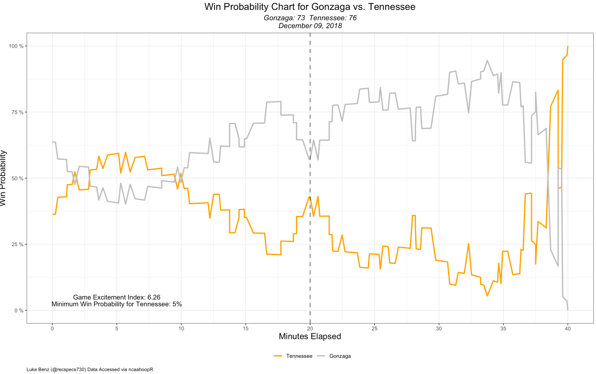
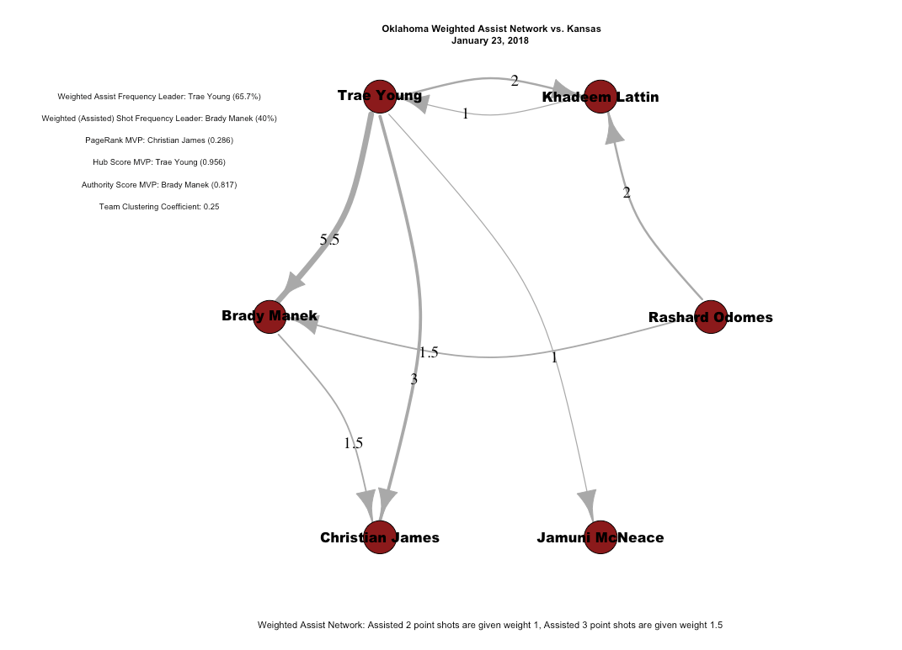
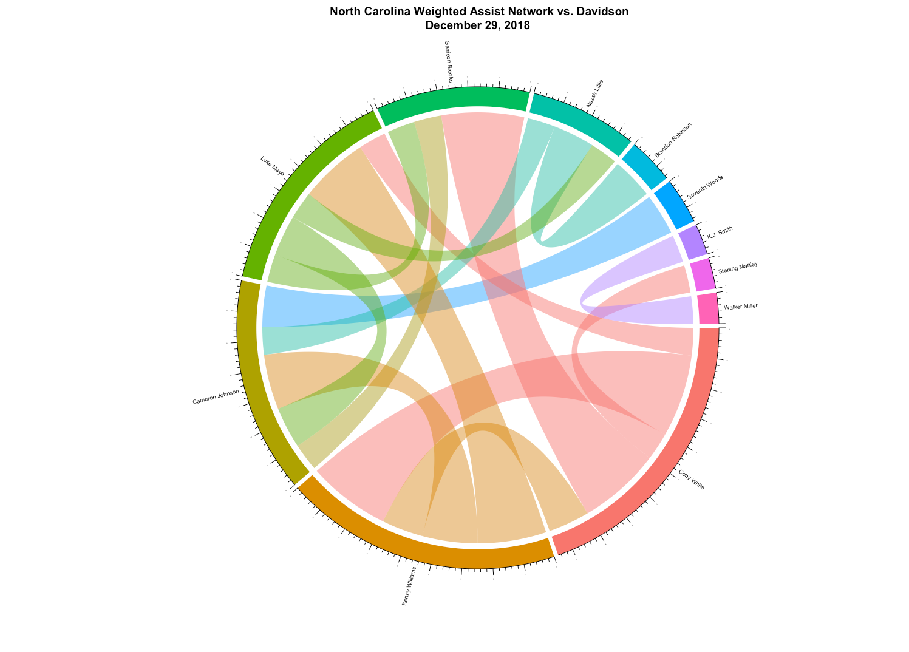
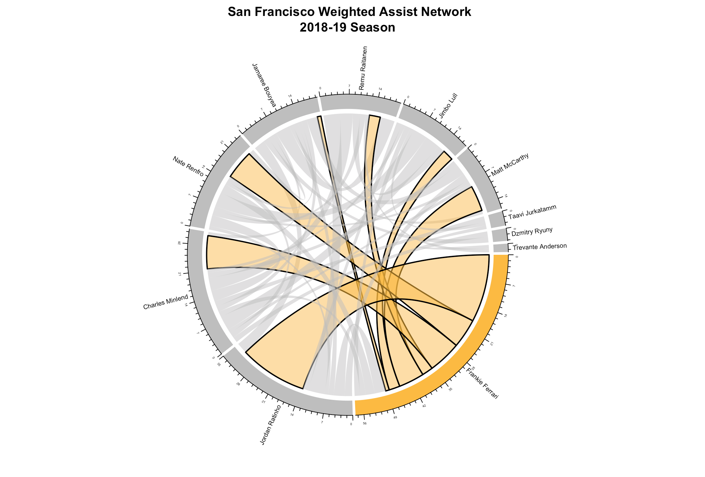
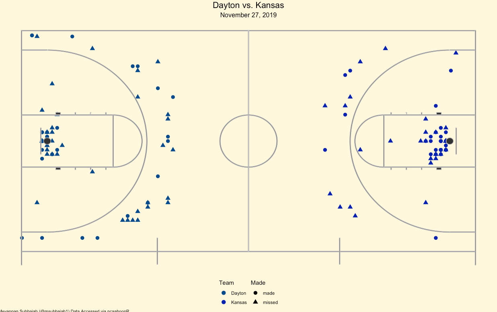

# ncaahoopR 
`ncaahoopR` is an R package for working with NCAA Basketball Play-by-Play Data. It scrapes play-by-play data 
and returns it to the user in a tidy format and allows the user to explore the data with assist networks and in-game win-probability charts.

__Note:__ `ncaahoopR` scrapes data from ESPN. Since ESPN is currently updating many college basketball pages, such as schedules and rosters,
some functionality may be temporarily unavailable. Once we approach the beginning of the season, all functionality should work as desired.


## Installation
You can install `ncaahoopR` from GitHub with:

``` r
# install.packages("devtools")
devtools::install_github("lbenz730/ncaahoopR")
```

If you encounter installation issues, the following tips have helped a few users succesfull install the package.

* If asked the option to compile any packages from source rather than installing existing binaries, choose `'No'`.
* Windows users with trouble installing the package should try running the following command before reinstalling the package: `Sys.setenv(R_REMOTES_NO_ERRORS_FROM_WARNINGS = "true")`
* Windows users with touble installing the `devtools` should try installing the `backports` package first via `install.packages("backports")`.


## Functions
Several functions use ESPN game_ids. You can find the game_id in the URL for the game summary, 
as shown in the URL for the summary of the UMBC-Virginia game below.


### Scraping Data
* ```get_pbp(team)```: Game entire current season's worth of play-by-play data for a given team.
* ```get_pbp_game(game_ids)```:  Get play-by-play data for a specific vector of ESPN game_ids. 
* ```get_roster(team)```: Get a particular team's roster. 
* ```get_schedule(team)```: Get a team's schedule.
* ```get_game_ids(team)```: Get a vector of ESPN game_ids for all games in which ```team``` plays in.
* ```get_master_schedule(year, month, day)```: Get schedule of all games for given date.

The `team` parameter in the above functions must be a valid team name from the `ids` dataset built into the package. See the __Datasets__ section below for more details.

### Win-Probability and Game-Flow Charts

__Win Probability Charts__

There are two functions for plotting win probability charts, one that uses base graphics (`wp_chart`), and another that uses the ```ggplot2``` library (```gg_wp_chart```). Both are maintained, as graphics in base R have some nice concatenation principles. Personally, I think ```gg_wp_chart``` looks nicer and is eaiser to edit should additional post-processing be desired.

```wp_chart(game_id, home_col, away_col, show_legend = T)```

* ```game_id``` ESPN game_id for the desired win probability chart.
* ```home_col``` Chart color for home team.
* ```away_col```: Chart color for away team.
* `include_spread`: Logical, whether to include pre-game spread in Win Probability calculations. Default = `TRUE`.
* ```show_legend```: Logical, whether or not to show legend/text on chart. Default = `TRUE`.


```gg_wp_chart(game_id, home_col, away_col, show_labels = T)```

* ```game_id``` ESPN game_id for the desired win probability chart.
* ```home_col``` Chart color for home team.
* ```away_col```: Chart color for away team.
* `include_spread`: Logical, whether to include pre-game spread in Win Probability calculations. Default = `TRUE`.
* `show_labels`: Logical whether Game Excitement Index and Minimum Win Probability metrics should be displayed on the plot. Default = `TRUE`.

__Game Flow Charts__

```game_flow(game_id, home_col, away_col)```

* ```game_id``` ESPN game_id for the desired game flow chart.
* ```home_col``` Chart color for home team.
* ```away_col```: Chart color for away team.

__Game Excitement Index__

```game_exciment_index(game_id, include_spread)```

* `include_spread`: Logical, whether to include pre-game spread in Win Probability calculations. Default = `TRUE`.

Returns ```GEI``` (Game Excitement Index) for given ESPN game_id. For more information about how these win-probability charts are fit and how Game Excitement Index is calculated, check out the below links


* [Model Methodology](https://lukebenz.com/post/ncaahoopr_win_prob/ncaahoopr_win_prob/)
* [Game Excitement Index](https://lukebenz.com/post/gei/)

__Game Control Measures__

```average_win_prob(game_id, include_spread)```

* ESPN game_id for which to compute time-based average win probability (from perspective of home team).
* `include_spread`: Logical, whether to include pre-game spread in Win Probability calculations. Default = `TRUE`.

```average_score_diff(game_id)```

* ESPN game_id for which to compute time-based average score differential (from perspective of home team).


### Assist Networks

__Traditional Assist Networks__

```assist_net(team, season, node_col, three_weights, threshold, message = NA)```

* ```team``` is the ESPN team name, as listed in the `ids` data frame.
* ```season```: Options include "2018-19" (for entire season), or a vector of ESPN game IDs. 
* ```node_col``` is the node color for the graph.
* ```three_weights``` (default = ```TRUE```): Logical. If TRUE, assisted three-point shots are given 1.5 weight. If FALSE, assisted three-point shots are given weight 1. In both cases, assisted two-point shots are given weight 1. 
* `threshold`: Number between 0-1 indicating minimum percentage of team assists/baskets a player needs to exceed to be included in network. Default = 0.
* ```message``` (default = ```NA```) Option for custom message to replace graph title when using a subset of the season (e.g. conference play).
* `return_stats`: Return Assist Network related statistics (default = `TRUE`)

__Circle Assist Networks and Player Highlighting__

```circle_assist_net(team, season, highlight_player, highlight_color, three_weights, message = NA)```

* ```team``` is the ESPN team name, as listed in the `ids` data frame.
* ```season```: Options include "2018-19" (for entire season), or a vector of ESPN game IDs. 
* ```highlight_player```: Name of player to highlight in assist network. `NA` yields full team assist network with no player highlighting. Default = `NA`.
* ```highlight_color```: Color of player links to be highlighted. `NA` if ```highlight_player``` is `NA`.
* ```three_weights``` (default = ```TRUE```): Logical. If TRUE, assisted three-point shots are given 1.5 weight. If FALSE, assisted three-point shots are given weight 1. In both cases, assisted two-point shots are given weight 1. 
* `threshold`: Number between 0-1 indicating minimum percentage of team assists/baskets a player needs to exceed to be included in network. Default = 0.
* `message`: User supplied plot title to overwrite default plot title, if desired. Default = `NA`.
* `return_stats`: Return Assist Network related statistics (default = `TRUE`)

### Shot Charts
There are currently three functions for scraping and plotting shot location data. These functions are written by [Meyappan Subbaiah](https://github.com/meysubb).

`get_shot_locs(game_id)`: Returns data frame with shot location data when available.

* `game_id`: ESPN game_id from which shot locations should be scraped.

`game_shot_chart(game_id, heatmap = F)`: Plots shots for a given game.

* `game_id`: ESPN game_id from which shot locations should be scraped.
* `heatmap`: Logical, whether to use density-heat map or plot individual points. Default = `FALSE`.

`team_shot_chart(game_ids, team, heatmap = F)`: Plots shots taken by team during a given set of game(s).

* `game_ids`: Vector ESPN game_ids from which shot locations should be scraped.
* `team`: Which team to chart shots for.
* `heatmap`: Logical, whether to use density-heat map or plot individual points. Default = `FALSE`.

`opp_shot_chart(game_ids, team, heatmap = F)`: Plots shots against a team during a given set of game(s).

* `game_ids`: Vector ESPN game_ids from which shot locations should be scraped.
* `team`: Which team to chart shots for.
* `heatmap`: Logical, whether to use density-heat map or plot individual points. Default = `FALSE`.

## Datasets

```dict``` A dataframe for converting between team names from various sites.
 
 * ```NCAA```: the name of the team, as listed on the NCAA website
 * ```ESPN```: the name of the team, as listed on the ESPN URLs
 * ```ESPN_PBP```: the name of the team, as listed on the ESPN Play-By-Play logs
 * ```Warren_Nolan```: the name of the team, as listed on WarrenNolan.com
 * ```Trank```: the name of the team, as listed on barttorvik.com
 * ```name_247```: the name of the team, as listed on 247Sports.com

```ids``` A data frame for converting between team names from various sites.
 
 * ```team```: the name of the team to be supplied to function in ncaahoopR package
 * ```id```: team id; used in ESPN URLs
 * ```link```: link; used in ESPN URLs
 
 
 ```ncaa_colors``` A data frame of team color hex codes, pulled from [teamcolorcodes.com](https://teamcolorcodes.com/). Additional data coverage provided by [Luke Morris](https://lukesmorris.com).
 

* `ncaa_name`: The name of the team, as listed on the NCAA website (same as `dict$NCAA`)
* `espn_name`: The name of the team, as listed on the ESPN URLs (same as dict$ESPN)}
* `primary_color`: Hexcode for team's primary color.
* `secondary_color`: Hexcode for team's secondary color, when available.
* `tertiary_color`: Hexcode for team's tertiary color, when available.
* `color_4`: Hexcode for team's 4th color, when available.
* `color_5`: Hexcode for team's 5th color, when available.
* `color_6`: Hexcode for team's 6th color, when available.


_Primary and secondary colors for all 353 teams._


These datasets can be loaded by typing ```data("ids")```, `data("ncaa_colors")`, or ```data("dict")```, respectively.

## Examples
#### Win Probability Charts

```wp_chart(game_id = 401025888, home_col = "navy", away_col = "goldenrod1")```


```gg_wp_chart(game_id = 401082978, home_col = "gray", away_col = "orange")```

#### Game Flow Chart

```game_flow(game_id = 401082669, home_col = "blue", away_col = "navy")```

#### Single-Game Assist Network

```assist_net(team = "Oklahoma", node_col = "firebrick4", season = 400989185)```

#### Season-Long Assist Network

```assist_net(team = "Yale", node_col = "royalblue4", season = "2017-18")```


__NOTE:__ The argument ```season = "2017-18"``` would be replaced with the current season. Backdated charts are currently not available.

#### Circle Assist Networks

```circle_assist_net(team = "UNC", season = 401082861)```

#### Player Highlighting

```circle_assist_net(team = "San Francisco", season = "2018-19", highlight_player = "Frankie Ferrari", highlight_color = "#FDBB30")```

#### Shot Charts

```game_shot_chart(game_id = 401083557, heatmap = T)```


`game_shot_chart(game_id = 401083557)`

## Glossary
Play-by-Play files contain the following variables:

* ```play_id```: Unique identifier of play/event in sequence of game events.
* ```half```: Period of action in the game. 1 and 2 denote the first and second halves of play, while 3 denotes OT1, 4 denotes OT2 etc.
* ```time_remaining_half```: Time remaining in the period as it would appear on a scoreboard.
* ```secs_remaining```: Time remaining in regulation, in seconds.
* ```secs_remaining_absolute```: The time remaining until the game is over, in seconds. For example a game that goes to overtime would begin with 2700 seconds remaining (2400 for regulation and 300 for overtime), and regulation would end with 300 seconds remaining.
* ```description```: A description of the play/game event.
* ```home_score```: Home team's score.
* ```away_score```: Away team's score.
* ```score_diff```: Score differential from the home team's perspective (```home_score``` - ```away_score```)
* ```play_length```: Duration of the the given play, in seconds.
* ```win_prob```: Win probability for the home team.
* ```naive_win_prob```: Win probability for the home team not factoring in pre-game point spread. Useful for computation of win probability added (WPA).
* ```home```: Name of the home team.
* ```away```: Name of the away team.
* ```home_timeout_remaining```: Number of timeouts remaining for the home team.
* ```away_timeout_remaining```: Number of timeouts remaining for the away team.
* ```home_favored_by```: Number of points by which the home team is favored, prior to tip-off. If Vegas point spread is available on ESPN, that is used as the default. When not available, an attempt is made to impute the pre-game point spread from derived team strengths. Imputed point spreads are not available for games prior to the 2016-17 season or when one of the teams is not in Division 1.
* ```game_id```: ESPN game_id for the game in question.
* ```date```: Date of game.

Shot Location data frames contain the following variables.

* `team_name`: Name of shooting team.
* `shot_text`: Description of shot.
* `color`: Color hexcode used to render shot chart graphic on ESPN.
* `date`: Date of game.
* `outcome`: Whether the shot was made or missed.
* `shooter`: Player attempting the shot.
* `assister`: Playing assisting the shot.
* `three_pt`: Logical, whether the shot is a 3-point attempt.
* `x`: x-coordinate of shot location.
* `y`: y-coordinate of shot location.

The court is 50 feet by 94 feet, with (0,0) always being placed in the bottom left corner of the shot chart. Any full-court shot chart rendered using `game_shot_chart()` preserves ESPN shot locations as they are found online, while halfcourt charts using `team_shot_chart()` convert all shot locations to to a 50 feet by 47 feet halfcourt. The perspective on the halfcourt shot charts is as if one is standing under the hoop, looking toward the opposition hoop. (0,0) again represents the bottom left corner and (50, 47) represents the top right corner. 
